# Very Very Very Good Swift Skill

Ship native iOS apps without confusing “it builds” with “it is ready.”

`launch-native-ios-app` takes a Swift or SwiftUI product from brief or inherited repository to a verified TestFlight or App Store release. It combines product definition, architecture, implementation guardrails, automated source inspection, measured Xcode builds, platform-service setup, App Review preparation, and an explicit release evidence ladder.

## The problems it fixes

| Problem | What the skill does | Output or proof |
| --- | --- | --- |
| The agent works in the wrong folder or edits a generated project | Resolves the real app root, workspace/project, scheme, targets, XcodeGen inputs, identities and manifests | Native iOS project inventory |
| SwiftUI appears correct but has unstable identity or expensive view structure | Audits positional identity, API age, animation scope and large view bodies, then requires runtime verification | Advisory Swift source audit with file and line evidence |
| Async work outlives its screen or ignores cancellation | Audits detached tasks and unsafe isolation escapes; builds a task-ownership ledger | Owner, actor, cancellation, result and deallocation table |
| Tests pass while sharing global state or contacting a live API | Enforces hermetic defaults, parallel isolation and separately authorized contract tests | Test-isolation findings and explicit test-plan boundaries |
| Xcode builds are slow but optimization is guesswork | Measures clean, cached-clean, zero-change and incremental scenarios before recommending changes | Timestamped logs, benchmark JSON and Markdown report |
| A successful build is reported as a launch | Tracks every release layer independently | Source → build → runtime → archive → upload → processing → TestFlight → device → submission → review/release ledger |
| Signing, push, auth and extensions drift apart | Maintains an identity matrix and keeps Apple credential types separate | App/extension/App Group/auth/APNs identity evidence |
| Store claims, screenshots or reviewer paths do not match the binary | Maps every claim to a reachable release-build feature and runs release preflight | Metadata, privacy, legal, reviewer and App Review checklist |

## How it works

```mermaid
flowchart LR
    A["Product brief or existing repo"] --> B["Resolve app identity and project inputs"]
    B --> C["Define the smallest complete user loop"]
    C --> D["Design and implement vertical slices"]
    D --> E["Audit SwiftUI, concurrency and tests"]
    E --> F["Build, run and measure"]
    F --> G["Integrate auth, push, links and privacy"]
    G --> H["Prepare metadata and App Review"]
    H --> I["Prove each release gate"]
```



The skill loads specialist references only when the task needs them. Optional specialist skills can deepen a concurrency, SwiftUI, testing, Core Data or build-performance investigation, but the bundled starter, inspectors, audit and benchmark runner provide a useful standalone baseline.

## Outputs

Depending on the request, the skill produces:

- a product acceptance contract with user loop, states, accessibility and non-goals
- a read-only project inventory of targets, identifiers, manifests and credential-file presence
- an advisory Swift source audit for concurrency, SwiftUI and test-isolation risks
- a task-ownership ledger for long-lived and unstructured async work
- a Swift 6, SwiftUI and XcodeGen starter with typed networking and Swift Testing
- repeatable Xcode build artifacts under `.build-benchmark/<timestamp>/`
- an optimization plan that separates evidence, expected impact, risk and approval
- a release evidence ledger naming the exact source revision, artifact, version and build
- a handoff that says `passed`, `failed`, `blocked` or `not checked` for every release gate

Source-audit findings are prompts for investigation, not automatic bug claims. Build measurements prove only the recorded build contract. Neither replaces current-source runtime, physical-device, TestFlight or App Store evidence.

## Included tools

```bash
# Inventory project identity and configuration
python3 "$SKILL_DIR/scripts/inspect_native_ios_project.py" /path/to/app

# Audit Swift source without modifying it
python3 "$SKILL_DIR/scripts/audit_swift_sources.py" /path/to/app

# Benchmark an Xcode project and preserve evidence
python3 "$SKILL_DIR/scripts/benchmark_xcode_builds.py" \
  --project /path/to/App.xcodeproj \
  --scheme App \
  --scenario clean \
  --scenario cached-clean \
  --scenario zero-change

# Create a greenfield SwiftUI/XcodeGen app
python3 "$SKILL_DIR/scripts/create_native_ios_app.py" \
  --name "Example App" \
  --bundle-id "com.example.app" \
  --output /path/to/ExampleApp \
  --generate
```

`SKILL_DIR` is the installed directory containing this skill’s `SKILL.md`.

## Who it is for

- indie iOS developers and technical founders using coding agents
- small teams moving a prototype toward TestFlight or the App Store
- developers inheriting a messy SwiftUI, UIKit or XcodeGen project
- teams that need an auditable handoff instead of a vague “it works” claim

It is not a replacement for a focused specialist when the entire request is one isolated Core Data, concurrency, testing or compiler-performance problem. It coordinates those domains when they affect the complete product or release.

## Install

```bash
npx skills add 0xfreddy/very-very-very-good-swift-skill
```

Then ask:

```text
Use $launch-native-ios-app to inspect this repository, implement the smallest complete user loop, and report every release evidence gate separately.
```

Or:

```text
Use $launch-native-ios-app to take this app from its current state to a verified TestFlight build. Do not call it ready until a real tester installs the processed build.
```

[MIT licensed](LICENSE).
